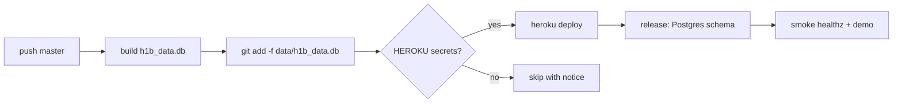

# Deploy checklist (Phase 3)

**Current state:** https://github.com/ixsx2/h1b-service — CI and Deploy workflows
passing. Deploy job **skips the Heroku push** until `HEROKU_*` GitHub secrets exist.

## Already done

| Item | Detail |
|------|--------|
| Public GitHub repo | https://github.com/ixsx2/h1b-service (`master`) |
| CI workflow | 31 pytest passed; ruff clean; `H1B_TESTING=1` in CI |
| Deploy workflow | Builds `h1b_data.db`, ready to push when secrets set |
| ETL cron | `.github/workflows/etl.yml` (quarterly) |
| Heroku manifest | `app.json`, `Procfile` release phase, `bin/post_compile` |
| Bootstrap helper | `python scripts/heroku_bootstrap.py` |
| Smoke script | `scripts/smoke.py` |

## Already wired (no secrets needed)

| Piece | Location |
|-------|----------|
| Heroku `app.json` (Postgres addon, env template) | `app.json` |
| Release-phase schema init | `Procfile` → `release:` |
| Buildpack fallback (`bin/post_compile`) | builds `data/h1b_data.db` from fixtures |
| ETL manifest + downloader | `etl/manifest.json`, `python -m etl.download` |
| Testmail e2e (optional in CI) | `tests/test_testmail_e2e.py` |
| SimpleAnalytics toggle | `SIMPLE_ANALYTICS=1` env var |

## Next steps — Ishan (priority order)

### 1. Heroku app + GitHub secrets (~15 min)

```bash
heroku login
python scripts/heroku_bootstrap.py   # prints app name + secret commands
```

```bash
heroku create YOUR_APP_NAME
heroku addons:create heroku-postgresql:essential-0 -a YOUR_APP_NAME
heroku authorizations:create -d "github-actions"   # → HEROKU_API_KEY
```

Add to **GitHub → Settings → Secrets → Actions**:

| Secret | Value |
|--------|-------|
| `HEROKU_API_KEY` | from `authorizations:create` |
| `HEROKU_APP_NAME` | your app name |
| `HEROKU_EMAIL` | your Heroku account email |

Then: **Actions → Deploy → Run workflow** (or push to `master`).

### 2. Heroku config vars

```bash
heroku config:set OTP_SECRET=$(openssl rand -hex 32) -a YOUR_APP_NAME
heroku config:set DEMO_EMPLOYER=DATADOG -a YOUR_APP_NAME
# After Resend + domain (step 3):
heroku config:set EMAIL_FROM=otp@yourname.dev RESEND_API_KEY=re_... -a YOUR_APP_NAME
```

`DATABASE_URL` is set automatically by the Postgres addon.

### 3. Domain + Resend

1. Redeem Name.com `.dev` domain (Student Pack); pick name
2. Resend: add domain, configure DKIM/SPF at Name.com
3. `heroku domains:add yourname.dev -a YOUR_APP_NAME`
4. Point DNS CNAME to Heroku target from `heroku domains`

### 4. Verify

```bash
# After deploy (demo only — no OTP yet)
python scripts/smoke.py --base-url https://YOUR_APP.herokuapp.com

# After Resend live
python scripts/smoke.py \
  --base-url https://yourname.dev \
  --email you@example.com \
  --otp-code 123456
```

### 5. Real production data (before "live" label)

1. Download FY2025/FY2026 DOL xlsx + USCIS CSV → `tests/fixtures/real/` (see README there)
2. Paste USCIS URL into `etl/manifest.json`
3. Local: `python -m etl.download --output data/sources && python scripts/build_data.py --source manifest`
4. `pytest tests/test_real_etl.py -v`
5. Re-run **Deploy** workflow

### 6. Optional

| Secret | Purpose |
|--------|---------|
| `TESTMAIL_API_KEY` + `TESTMAIL_NAMESPACE` | Real OTP e2e in CI |
| `HONEYBADGER_ETL_CHECKIN_URL` | Quarterly ETL watchdog |

## Phase 4 (after URL is live)

| Service | Env var |
|---------|---------|
| SimpleAnalytics | `SIMPLE_ANALYTICS=1` |
| Sentry | `SENTRY_DSN` (wire `sentry-sdk` when ready) |
| Honeybadger | `HONEYBADGER_ETL_CHECKIN_URL` |

## What deploy does



## Related

- [PLAN.md](../PLAN.md) — full work log and phase table
- [future-considerations.md](future-considerations.md) — Sponsorly integration (deferred)
